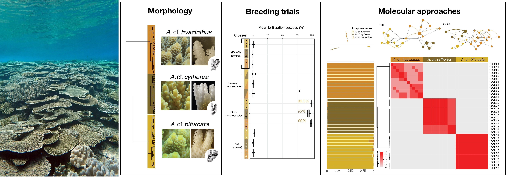

# Species delimitation in tabular <i>Acropora</i> from Sesoko Island (Okinawa, Japan)

<b>Data from submitted manuscript:</b> C. Ramírez-Portilla, A. H. Baird, P. F. Cowman, A. M. Quattrini, S. Harii, F. Sinniger, J. F. Flot, <i>Solving the coral species conundrum</i> (2020)

All in the information in this repository corresponds to the supplementary information for the manuscript. To see a detailed description of each item, read the corresponding README file in each folder:

<b>Morphology/</b>

<b>Breeding_trials/</b>

<b>Molecular_approaches/</b>

